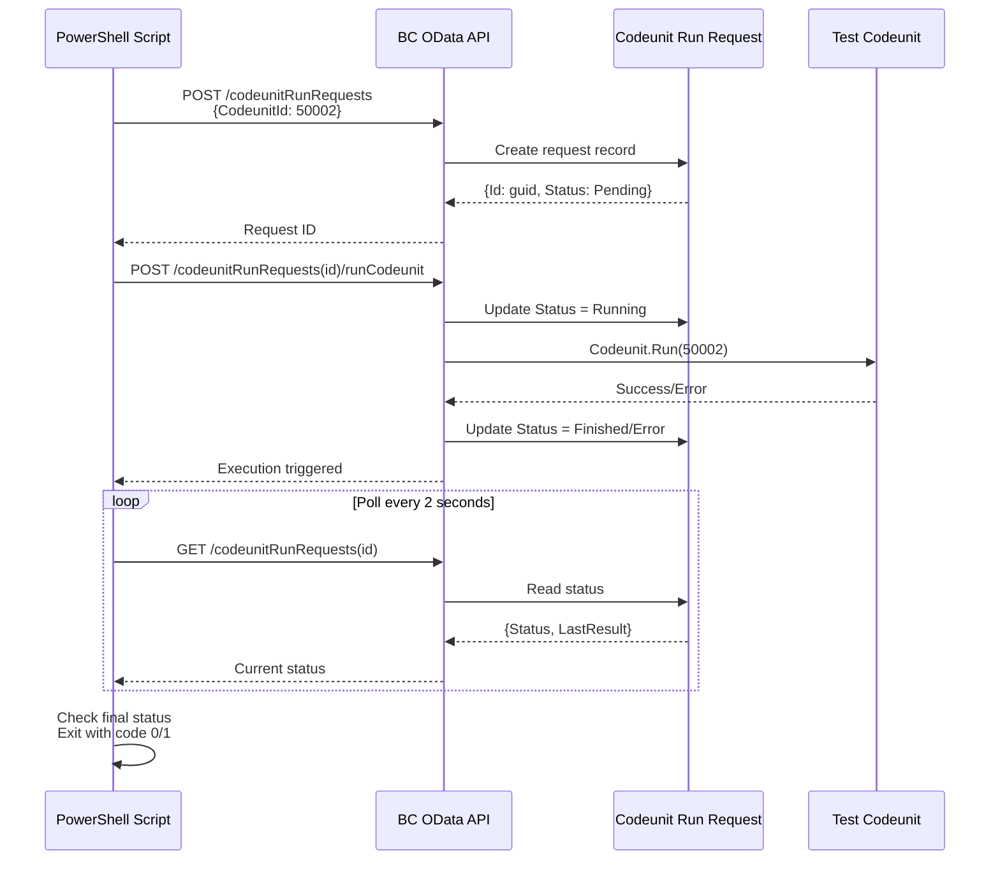

# Test Execution Scripts

This directory contains scripts for executing AL tests via the OData API.

## OData Test Execution

### Overview

The `run-tests-odata.ps1` script executes AL test codeunits via the Business Central OData API using the **Codeunit Run Request** system (table 50003 / page 50002).

### Architecture

The test execution uses a stateful execution pattern:

1. **Create Request** - POST to `/api/custom/automation/v1.0/codeunitRunRequests`
   - Creates a new execution request record
   - Sets the `CodeunitId` to the test codeunit to execute
   - Returns a GUID identifier for the request

2. **Execute Codeunit** - POST to `.../codeunitRunRequests({id})/Microsoft.NAV.runCodeunit`
   - Triggers the execution of the specified codeunit
   - Updates the request status to "Running"
   - Executes the codeunit via `Codeunit.Run()`

3. **Poll for Status** - GET from `.../codeunitRunRequests({id})`
   - Retrieves the current execution status
   - Status values: `Pending`, `Running`, `Finished`, `Error`
   - Includes `LastResult` field with success message or error text

4. **Check Results** - Inspect final status and result message
   - `Finished` status = successful execution (exit code 0)
   - `Error` status = failed execution (exit code 1)
   - `LastResult` contains error message on failure

### Usage

#### Local Testing

```bash
# Execute test codeunit 50002 against local BC container
# Note: OData port is 7048, SOAP/web services port is 7049
pwsh ./scripts/run-tests-odata.ps1 \
  -BaseUrl "http://localhost:7048/BC" \
  -CodeunitId 50002
```

#### GitHub Actions (Linux Pipeline)

The script is integrated into the Linux pipeline at [.github/workflows/build-linux.yml](../.github/workflows/build-linux.yml:366):

```yaml
- name: Run AL Tests in Container via OData
  run: |
    pwsh ./scripts/run-tests-odata.ps1 \
      -BaseUrl "http://localhost:7048/BC" \
      -Tenant "default" \
      -Username "admin" \
      -Password "P@ssw0rd123!" \
      -CodeunitId 50002 \
      -MaxWaitSeconds 300
```

### Parameters

| Parameter | Required | Default | Description |
|-----------|----------|---------|-------------|
| `BaseUrl` | No | `http://localhost:7048/BC` | Base URL of BC instance (OData port) |
| `Tenant` | No | `default` | Tenant name |
| `Username` | No | `admin` | Authentication username |
| `Password` | No | `P@ssw0rd123!` | Authentication password |
| `CodeunitId` | No | `50002` | Test codeunit ID to execute |
| `MaxWaitSeconds` | No | `300` | Maximum wait time for completion |

### API Endpoints

The script uses the following BC API endpoints:

- **API Page**: `50002` - "Codeunit Run Requests"
- **Source Table**: `50003` - "Codeunit Run Request"
- **Endpoint Base**: `/api/custom/automation/v1.0/codeunitRunRequests`
- **Action**: `Microsoft.NAV.runCodeunit` - Service-enabled procedure

### Test Codeunit Structure

Test codeunits executed via this system should follow this pattern (see [src/testrunner/cu50100.al](../src/testrunner/cu50100.al)):

```al
codeunit 50002 "Test CU"
{
    Subtype = Test;

    trigger OnRun()
    var
        Log: Record "Log Table";
    begin
        // Perform test operations
        // ...

        // Log execution for audit trail
        Log.Init();
        Log."Message" := 'Test CU ran successfully';
        Log."Computer Name" := 'GithubActions';
        Log.Insert();
    end;
}
```

### Execution Flow



### Exit Codes

- `0` - Test execution succeeded (Status = "Finished")
- `1` - Test execution failed (Status = "Error" or timeout)

### Troubleshooting

#### Connection Errors

If you get connection errors, verify:
- BC container is running: `docker ps`
- BC OData service is accessible: `curl http://localhost:7048/BC/api/v2.0/companies`
- API page is published with the extension
- You're using port 7048 for OData (not 7049 which is for SOAP)

#### Authentication Errors (401)

- Verify credentials match the container configuration
- Check if web service authentication is enabled
- Confirm user has permissions to the API endpoint

#### Timeout Errors

- Increase `MaxWaitSeconds` parameter
- Check BC container logs for errors: `docker logs <container-name>`
- Verify the test codeunit doesn't have infinite loops

#### API Not Found (404)

- Confirm the extension is published to the container
- Verify API page 50002 is included in the compiled app
- Check API endpoint path matches: `/api/custom/automation/v1.0/codeunitRunRequests`

### Related Files

- **PowerShell Script**: [scripts/run-tests-odata.ps1](./run-tests-odata.ps1)
- **API Page**: [src/testrunner/runnertable.al](../src/testrunner/runnertable.al) (page 50002)
- **Request Table**: [src/testrunner/runnertable.al](../src/testrunner/runnertable.al) (table 50003)
- **Test Codeunit**: [src/testrunner/cu50100.al](../src/testrunner/cu50100.al) (codeunit 50002)
- **Log Table**: [src/testrunner/Log.al](../src/testrunner/Log.al) (table 50002)
- **Test Runner API**: [src/testrunner/cu50199.al](../src/testrunner/cu50199.al) (codeunit 50003)

### Performance Metrics

The Linux pipeline tracks test execution duration:
- `TEST_DURATION` - Total time from script start to completion
- Includes API request time, execution time, and polling overhead
- Typically ranges from 5-30 seconds depending on test complexity

### Future Enhancements

Potential improvements to consider:

1. **Batch Execution** - Execute multiple test codeunits in sequence
2. **Log Retrieval** - Create API page for Log Table and fetch logs automatically
3. **Test Results API** - Expose AL test framework results via OData
4. **Parallel Execution** - Run multiple tests concurrently using task scheduler
5. **Test Discovery** - Auto-discover all test codeunits and execute them
